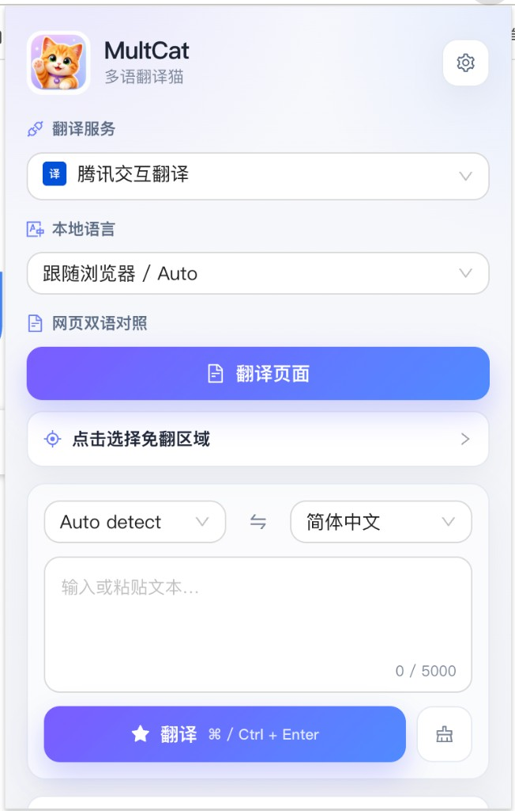
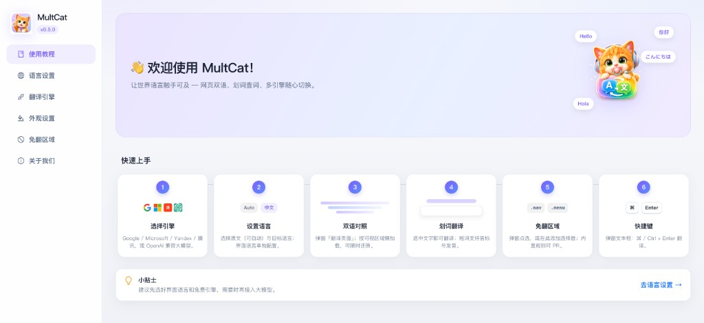
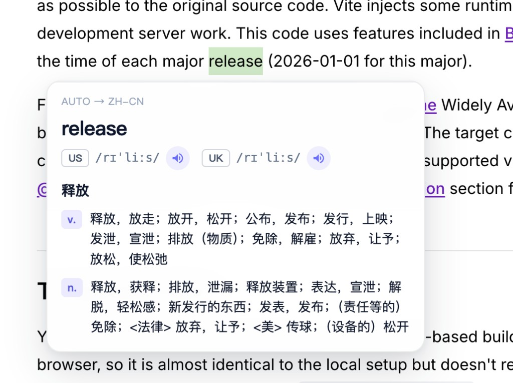

<p align="center">
  
</p>

<h1 align="center">MultCat</h1>

<p align="center"><strong>English</strong> · <a href="./README.zh-CN.md">中文</a></p>

<p align="center"><strong>Multilingual Translation Cat</strong> — a browser translation extension for Chrome / Chromium / Firefox. Source is public; commercial use is not allowed.</p>

<p align="center">Bilingual webpage translation, selection lookup, multi-engine switching. Settings and data stay on your device.</p>

## Download & install

After a `v*` git tag is pushed, GitHub Actions builds and publishes to **Releases**.

<!-- release-download:start -->
<p align="center">
  <a href="https://github.com/rokiai/mult-cat/releases/latest"></a>
</p>

**Current version: [v0.5.1](https://github.com/rokiai/mult-cat/releases/tag/v0.5.1)** · [All releases](https://github.com/rokiai/mult-cat/releases)

| Browser | Latest package | This version |
| --- | --- | --- |
| Chrome / Edge / Chromium | [MultCat-chrome.zip](https://github.com/rokiai/mult-cat/releases/latest/download/MultCat-chrome.zip) | [v0.5.1](https://github.com/rokiai/mult-cat/releases/download/v0.5.1/MultCat-0.5.1-chrome.zip) |
| Firefox | [MultCat-firefox.xpi](https://github.com/rokiai/mult-cat/releases/latest/download/MultCat-firefox.xpi) | [v0.5.1](https://github.com/rokiai/mult-cat/releases/download/v0.5.1/MultCat-0.5.1-firefox.xpi) |

Install (Chrome): download the zip → unzip → open `chrome://extensions` → enable Developer mode → **Load unpacked** → select the unzipped folder.
<!-- release-download:end -->

## Features

| Feature | Description |
| --- | --- |
| **Bilingual page translate** | One-click bilingual view; viewport lazy-load while scrolling; restore anytime |
| **Selection translate** | Select page text to translate (toggle in settings) |
| **Popup text translate** | Paste or type in Popup; `⌘/Ctrl + Enter` to translate |
| **Multiple engines** | Google, Microsoft, Yandex, Tencent Interactive, plus OpenAI-compatible LLMs |
| **LLM providers** | OpenAI, Kimi, DeepSeek, Zhipu, Tongyi, Doubao, SiliconFlow, OpenRouter, and custom gateways |
| **Skip areas** | Popup pick mode, user CSS rules, import/export, and maintainer JSON (PRs welcome) |
| **Dictionary + audio** | Short words show IPA, definitions, and pronunciation |
| **Localized UI** | Chinese, English, Japanese, Korean, and more |
| **Local storage** | API tokens and preferences stay in the browser only |

## Screenshots

### Popup

Engine, UI language, page bilingual, skip pick, and text translate.

<p align="center">
  
</p>

### Settings · guide

Welcome banner, six-step quick start, and sidebar settings.

<p align="center">
  
</p>

### Selection translate

Select text for translation, IPA, definitions, and audio.

<p align="center">
  
</p>

## Changelog

Full notes: [`CHANGELOG.md`](./CHANGELOG.md).

### 0.5.1 — 2026-07-18

- Fix: selection popup is no longer bilingual-translated during page bilingual mode

### 0.5.0 — 2026-07-18

- MultCat branding and refreshed Settings / Popup UI
- Bilingual page: viewport lazy-load, continue on scroll, restore
- Selection / Popup: IPA, definitions, and audio for short words
- Engines: Google / Microsoft / Yandex / Tencent + OpenAI-compatible LLMs
- Skip areas: pick mode, custom selectors, builtin site rules (PRs welcome)
- Localized UI and local-only preferences

## Quick start (development)

```bash
# Node.js (see .nvmrc) and pnpm required
pnpm install
pnpm dev          # Chrome dev build → dist/
# pnpm dev:firefox
```

1. Open `chrome://extensions`
2. Enable **Developer mode**
3. **Load unpacked** → select the project `dist` folder

Production build / zip locally:

```bash
pnpm build
pnpm zip          # → dist-zip/
# pnpm zip:firefox
```

### Release (GitHub Release)

Write changelog entries **before** tagging (CI does **not** auto-update these):

1. **`CHANGELOG.md`**: Keep a Changelog sections at the top (`Added` / `Changed` / `Fixed`, etc.)
2. **`pages/options/src/changelog.ts`**: sync short highlights for Settings (`zh` / `en`)
3. (Optional) add a one-line summary under Changelog in this README / `README.zh-CN.md`

Then bump version, commit, and tag:

```bash
# replace 0.5.1 with the target version
pnpm update-version 0.5.1

git add CHANGELOG.md pages/options/src/changelog.ts README.md README.zh-CN.md package.json
# include any package.json files touched by update-version
git add -u

git commit -m "chore: release v0.5.1"
git tag v0.5.1
git push origin HEAD
git push origin v0.5.1
```

After a `v*` tag is pushed, [`.github/workflows/release.yml`](.github/workflows/release.yml) will:

1. Build Chrome zip / Firefox xpi
2. Create a GitHub Release and upload packages (`generate_release_notes` is commit-based and is **not** the same as `CHANGELOG.md`)
3. Auto-update download links in `README.md` and `README.zh-CN.md` on the default branch

## Usage (end users)

1. Install MultCat and pin it to the toolbar
2. Open Popup; pick engine and target language
3. Click **Translate page** for bilingual reading; **Restore** when needed
4. Select text on a page for selection translate
5. For nav/code you do not want translated: Popup → **Pick skip area**, or add selectors in Settings; improve builtins via `packages/storage/lib/impl/builtin-site-rules.json` PRs
6. For LLMs: Settings → engine → OpenAI-compatible → vendor / model / token

Full walkthrough: **Popup → Guide** (opens Settings guide).

## Contributing skip rules

Builtin skip rules (exclude only; no “include where to translate”):

```
packages/storage/lib/impl/builtin-site-rules.json
```

Example:

```json
{
  "matches": ["example.com", "*.example.com"],
  "excludeSelectors": ["nav", "code", "pre", ".sidebar"]
}
```

- `matches`: host patterns (`*`, `*.domain.com`)
- `excludeSelectors`: CSS selectors that must not be translated (merged with user rules)

Runtime prefers the remote file on `main` (24h cache) and falls back to the bundled JSON. See [`packages/storage/lib/impl/SITE_RULES_SOURCE.md`](packages/storage/lib/impl/SITE_RULES_SOURCE.md).

## Stack

- Manifest V3, React, TypeScript, Vite, Turborepo, Ant Design
- Translation core: `packages/translate`
- Settings storage: `packages/storage`
- Content scripts: `pages/content` (DOM bilingual, selection, skip pick)
- UI: `pages/popup`, `pages/options`

## Layout (brief)

```
chrome-extension/     # manifest, background, shared assets
pages/
  popup/              # toolbar popup
  options/            # settings + guide
  content/            # page injection
packages/
  translate/          # engine adapters
  storage/            # settings & skip rules
  i18n/               # extension name strings
  ui/                 # shared UI (e.g. engine logos)
```

## License

**[PolyForm Noncommercial License 1.0.0](https://polyformproject.org/licenses/noncommercial/1.0.0)**.

- **Allowed**: personal learning, research, hobby, education / nonprofits; modify and redistribute with license and copyright notice
- **Not allowed**: any commercial use (sales, embedding in commercial products, commercial SaaS, etc.)

Full terms: [LICENSE](./LICENSE). Third-party dependencies keep their own licenses.

## Contributing

Issues and PRs welcome (bugs, engines, UI, docs) under the noncommercial license. Before submitting:

```bash
pnpm lint
pnpm type-check
pnpm build
```
